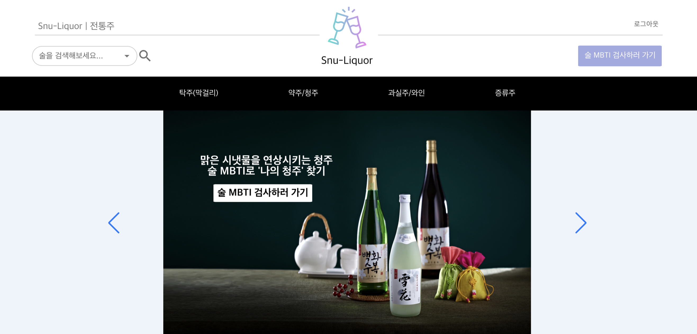
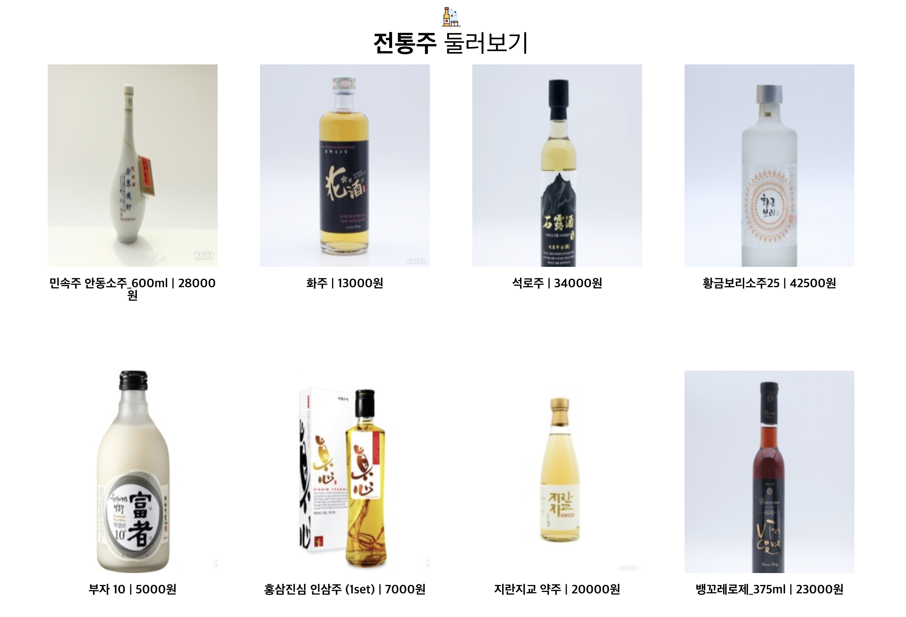
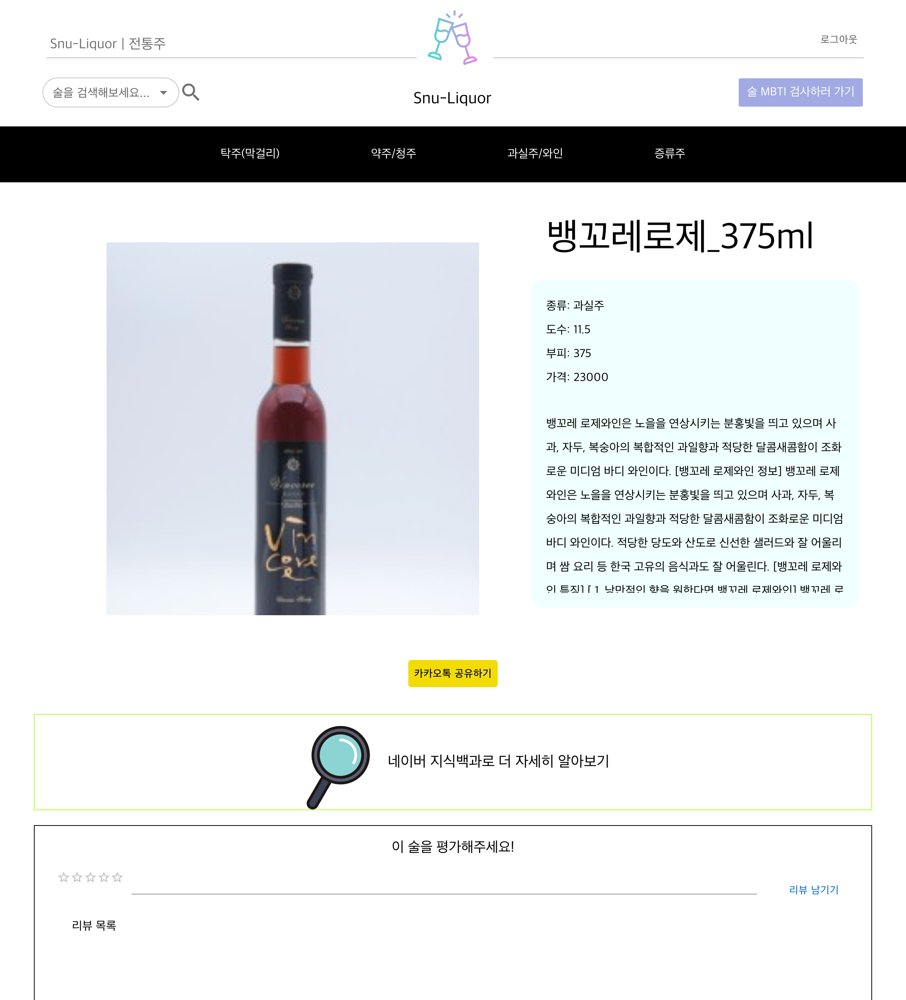
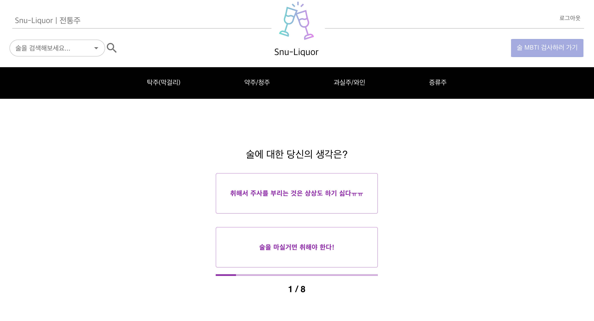
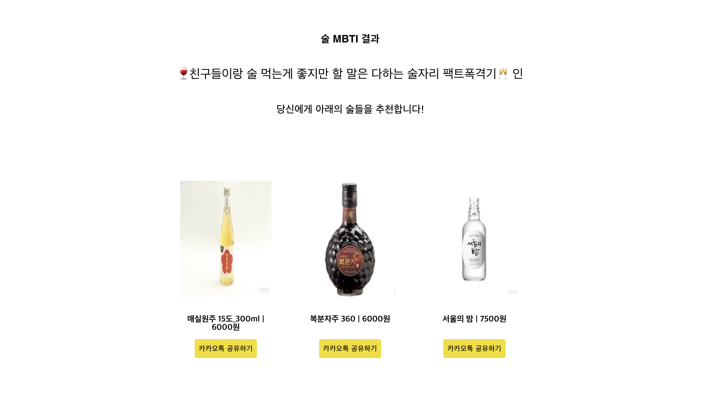
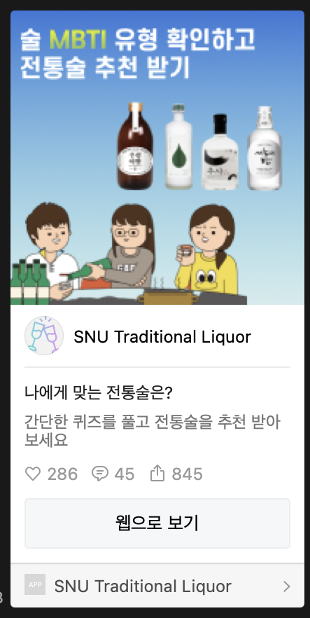
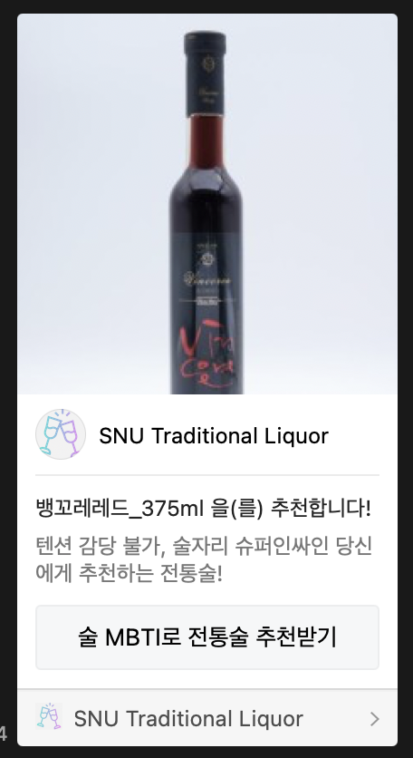
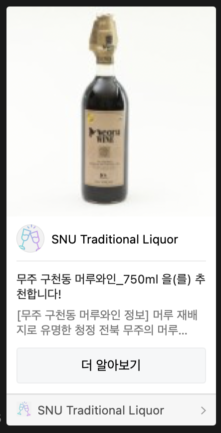

# 전통술 백과사전

최근 트렌디한 전통술(원소주 등)이 시장에 나오고 있음.
이 기회에 전통술에 대한 MZ 세대의 관심을 높이기 위한 웹사이트를 제작함. 
전통술 백과사전을 제공하며, MZ 세대의 관심을 위해 술 MBTI 검사를 추가했고
검사결과 기반으로 본인에게 맞는 전통술을 추천해주는 기능을 넣음.

---
## 주요 기능
### 홈 화면

전통술을 검색하거나, 주종별로 전통술을 확인할 수 있음. 
전통술을 둘러볼 수도 있음.
 
### 상세 페이지

전통술 선택 시 상세 페이지에서 자세한 정보를 확인 가능함. 
카카오톡으로 전통술을 공유할 수도 있으며 리뷰를 남길 수도 있음. 
네이버 지식백과 버튼 클릭 시 네이버 지식백과에서 해당 전통술 정보를 확인 가능함.

### 술 MBTI 검사

술 MBTI 검사를 통해 본인의 술자리 성격을 알 수 있음.  
그리고 해당 검사 결과를 기반으로 전통술을 추천함. 추천받은 전통술을 카카오톡으로 공유할 수 있음.

### 카카오톡 공유하기

  
  
  

카카오톡 공유하기 기능으로 전통술을 카카오톡으로 공유할 수 있음.

--- 
### 기술 스택
- Front End : `ReactJs` / `Recoil` / `JQuery`
- Database : `Firebase Cloud Firestore`

### 릴리즈 노트
- 2022.06.22 : `1.0.0` 배포
  - 접속 url: https://webprogramming-a287a.web.app
### 개발자
- 구근우 `9geunu`
- 권민규 `sgeunhi`
- 권재영 `jaylions`
- 김진호 `jho378`
